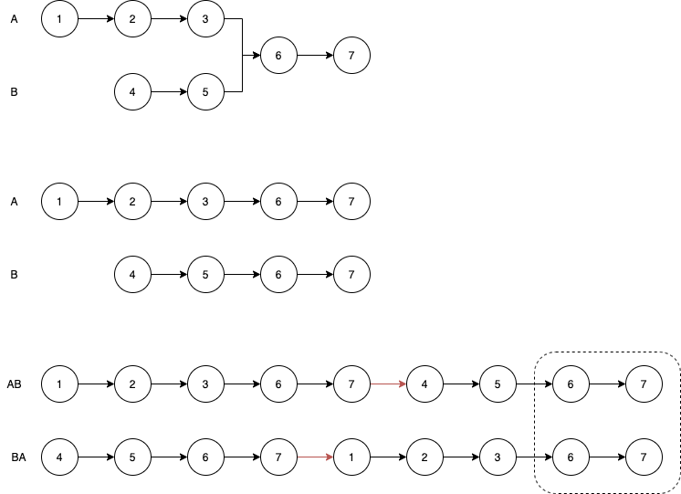

# 思路1 - 使用Set
- 时间复杂度：O(n)
- 空间复杂度：O(n)
A链表先走，边走边往Set加元素，直到尽头。
B链表遍历，判断是否有元素存在Set中，有则说明是入口

# 思路2 - 求长度差，再一起走
计算出AB链表长度差x，长的先走x步，再一起走，直到相遇则说明是入口
- 时间复杂度：O(n)
- 空间复杂度：O(1)

# 思路3 - 变轨解法

AB拼接，BA拼接，从头开始往后遍历，直到相等
需要变轨操作a->b.head,b->a.head
- 时间复杂度：O(n)
- 空间复杂度：O(1)